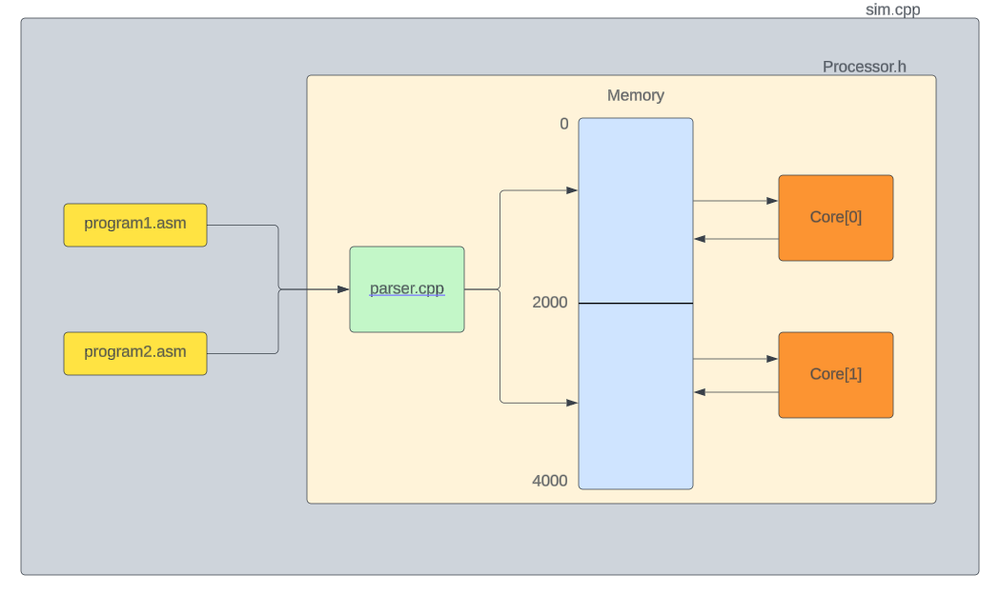

# Phase 1
Here is our implimentation of a basic risc v  *dual core* simmulator built in c++. We have tested it by runnig two sorting algorithms simultaniously

To see the result clone the repo, and run the following commands in terminal
```console=
g++ -o parser.o -c Parser.cpp
```
```console=
g++ sim.cpp parser.o
```
```console=
./a.out
```
## Features Implimented

- add
- addi
- sub
- lw
- sw
- branch instructions(bne,beq,jal,blt....)
- slli
- ecall

## Design


## Key design descions

- choice of language: c++
- usage of string stream to tokenise the characters
- Declaring regester array as long int and typecasting it store pointers
- using unordered map to store label and pointer to label as key-value pairs
- usage of parser to parse data into unordered map 
- usage of a tail pointer to keep track of memory

## Minutes of meeting(to be held)

